<div align="center">

# Bodhiorchard&trade;

### Ship software, not Scrum ceremonies.

**The open-source, self-hosted alternative to Jira & Scrum — AI agents run the process end-to-end, developers earn XP for what actually ships, and your data never leaves your machine.**

[](https://opensource.org/licenses/Apache-2.0)
[](https://bodhiorchard.ai/)
[](https://www.python.org/downloads/)
[](https://vuejs.org)
[](https://www.docker.com)

[Website](https://bodhiorchard.ai/) · [Quick Start](#quick-start) · [Why Bodhiorchard](#why-bodhiorchard) · [The Twelve Agents](#the-twelve-agents) · [Docs](#documentation) · [FAQ](#faq)

<a href="https://bodhiorchard.ai/">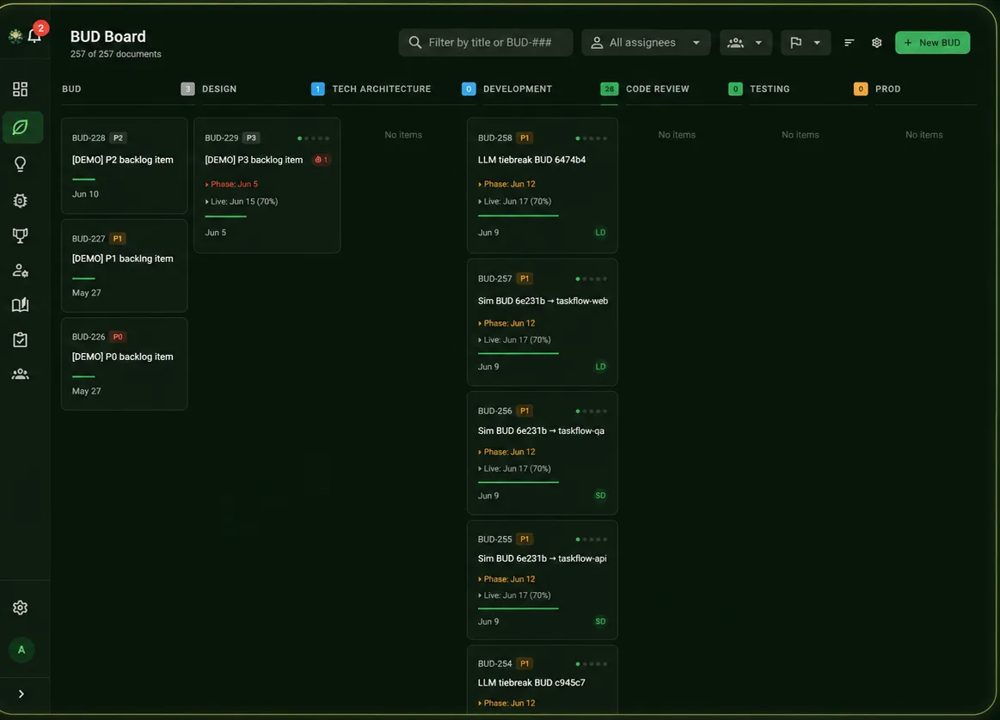</a>

**[▶ Watch the demo](https://youtu.be/i8kZdcL1bME)** — a Slack message becomes a scoped, estimated BUD. No sprints, no story points, no standups.

</div>

---

**Bodhiorchard** replaces sprint, scrum, and Jira ceremony with **Agent-Driven Development (ADD)** — twelve specialised AI agents handle the busywork (triage, specs, estimates, test plans, retrospectives) while humans keep the decisions that matter, and developers earn XP for the work that actually reaches production. It's a **self-hosted Jira alternative** for the full lifecycle: intake → spec → design → development → testing → deploy → retrospective. The data plane stays on your hardware; inference runs through your choice of agent CLI — [Claude Code](https://docs.anthropic.com/en/docs/claude-code), [GitHub Copilot](https://docs.github.com/en/copilot/concepts/agents/about-copilot-cli), or [OpenAI Codex](https://developers.openai.com/codex/cli) — picked per organization in setup, with Ollama next.

> **Less process. More shipped.** The full methodology lives at [bodhiorchard.ai](https://bodhiorchard.ai/).

## Quick Start

The fastest path — no clone, no build. Needs only **Docker (running)** and **Node.js 18+**:

```bash
npx bodhiorchard init     # detect ports, generate secrets, pull prebuilt images
cd bodhiorchard
npx bodhiorchard start    # start the stack and open the setup wizard
```

The wizard opens at **http://localhost:3000/setup** — finish there (organization, admin account, AI provider, repositories). `bodhiorchard stop` brings it down; your data volumes persist.

Prefer to build from source?

```bash
git clone https://github.com/mickyarun/bodhiorchard.git
cd bodhiorchard
docker compose up
```

Already running `claude` on your laptop? **Hybrid mode** reuses your Claude Pro/Max login instead of an API key:

```bash
npm install && npm run setup && npm run dev
```

→ All three paths, the full `bodhiorchard` CLI command list, prerequisites, mode-switching, and a ready-made demo dataset: **[Deployment Guide](docs/deployment.md)**

## Why Bodhiorchard

| | |
|---|---|
| 🤖 **AI drafts, you decide** | Agents write the specs, tech plans, and test cases. Humans review, edit, and approve at every phase — judgement stays human. |
| 🎯 **Predictions, not poker** | AI-PERT + 10,000 Monte Carlo simulations give P50/P70/P85 delivery dates per phase — factoring skill profiles, backlog, and workload. No story points. |
| 📄 **One BUD per feature** | A single living document (spec + tech spec + test plan + history) replaces tickets scattered across Jira, Confluence, Notion, and Slack. |
| 🌱 **Knowledge that stays current** | Auto-synced from code, vector-indexed, and fed into every agent prompt. No stale wiki pages. |
| 🏆 **XP for shipped work** | Developers level up when their PRs reach production — recognition for shipped outcomes, split across contributors, never for hours logged or tickets closed. |

### Old way vs Agent-Driven Development

| Phase | Scrum / Agile | Bodhiorchard |
|---|---|---|
| **Intake** | Jira ticket, manual triage, sprint planning | Slack message → Triage Agent interviews, dedupes, estimates |
| **Estimation** | Story points, planning poker | Probabilistic per-phase dates with confidence intervals |
| **Specification** | PM writes docs, reviews in meetings | BUD Agent drafts with codebase context; PM approves |
| **Development** | Dev picks a ticket, starts from scratch | Best-fit dev auto-suggested from skill profiles; implements from a file-level tech plan |
| **Testing** | QA writes cases manually | Auto-generated unit / integration / e2e / security / UAT plans |
| **Deployment** | Release train, manual status updates | Status Agent detects PR merges; BUD becomes a shipped Feature |
| **Retrospective** | Biweekly meeting, action items forgotten | Learning Agent auto-generates one on every deployment |

## Screenshots

| Slack triage — a message in, a BUD out | One BUD per feature — spec to prod |
|---|---|
| 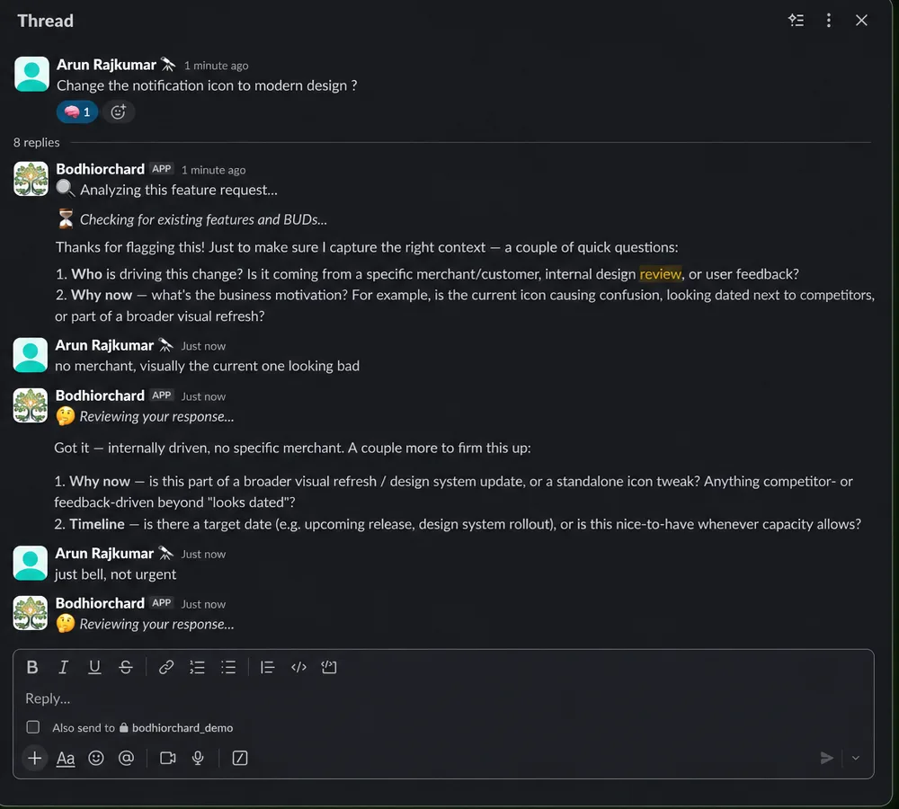 | 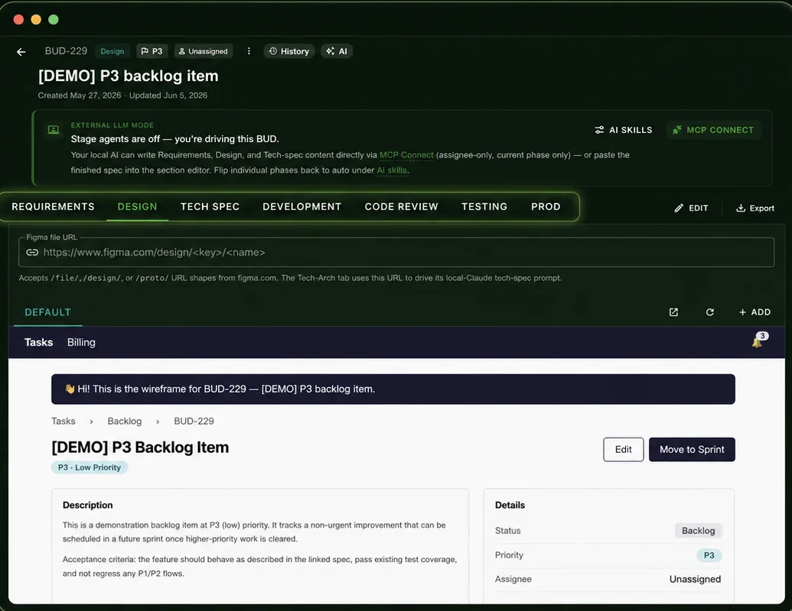 |

| AI drafts the tech spec, you decide | Feature registry — every feature, every dev |
|---|---|
| 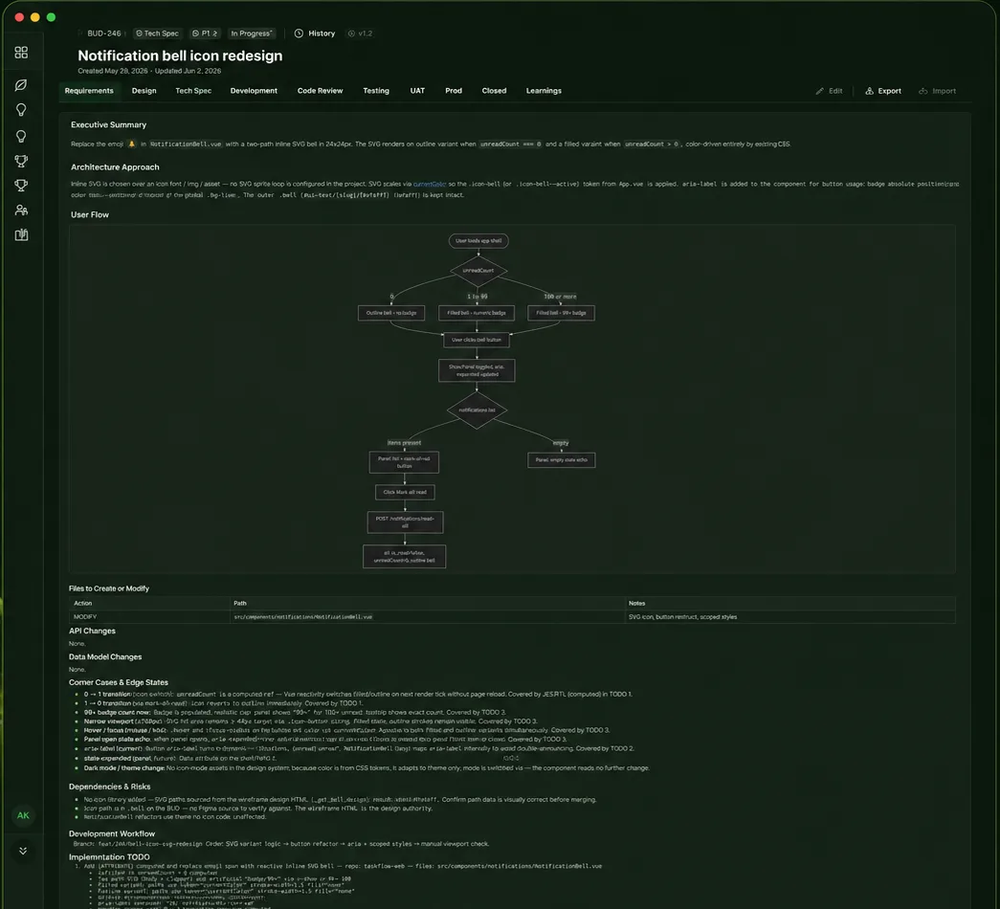 | 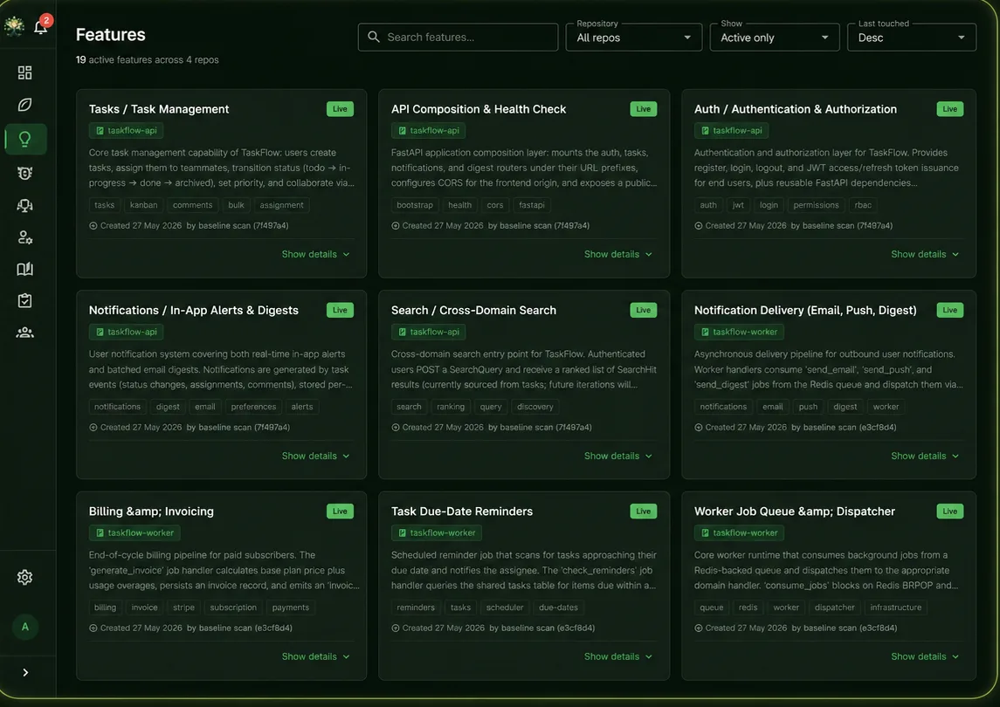 |

| Cross-repo code graph — one map | Bring your own AI — MCP knowledge |
|---|---|
| 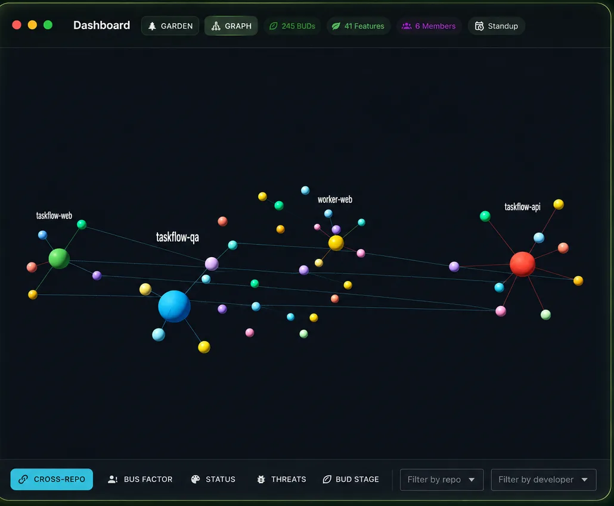 | 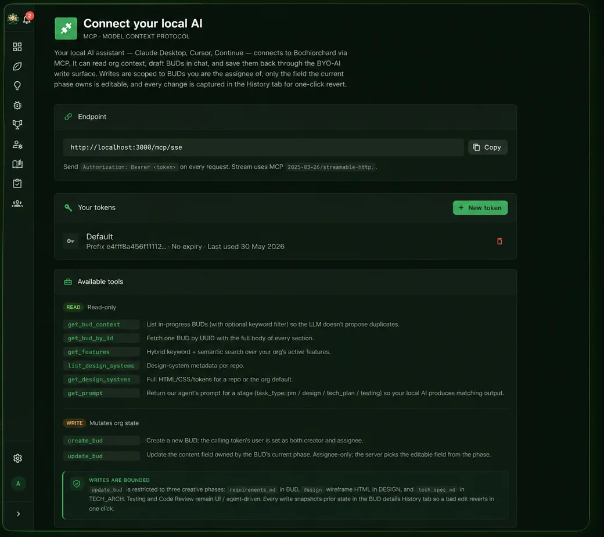 |

<div align="center">

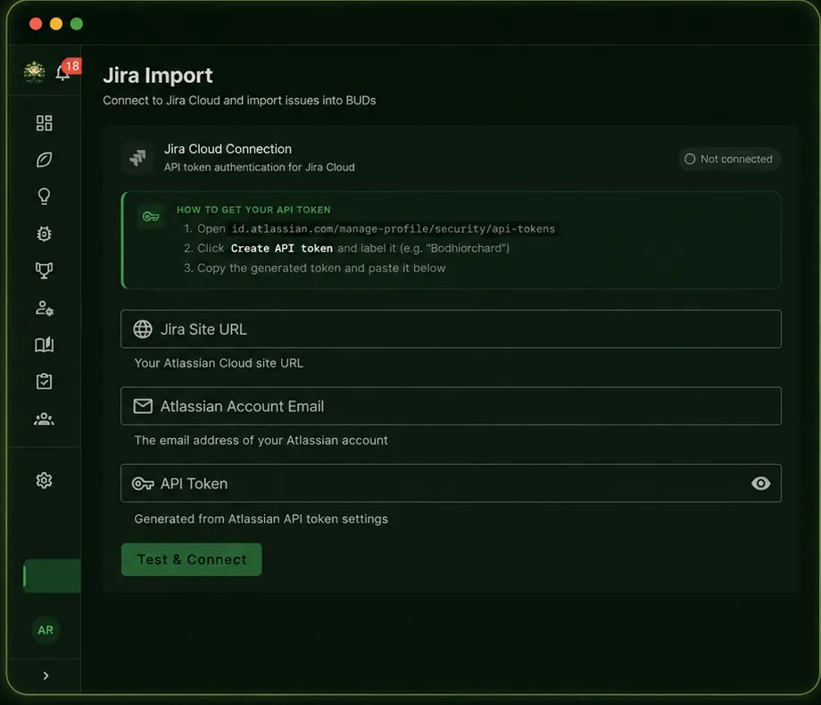

</div>

The gamification layer rebuilds developer skill profiles nightly — skills compound, badges unlock, and the leaderboard reflects shipped value, not ticket count:

| | | | |
|---|---|---|---|
| 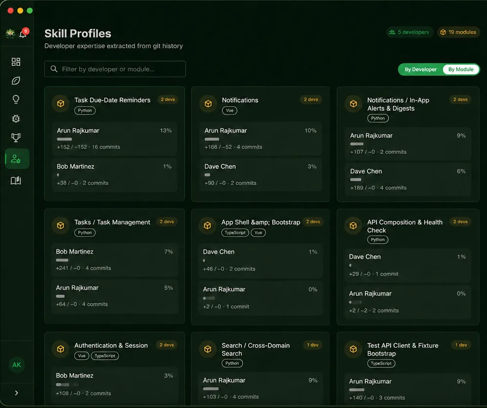 | 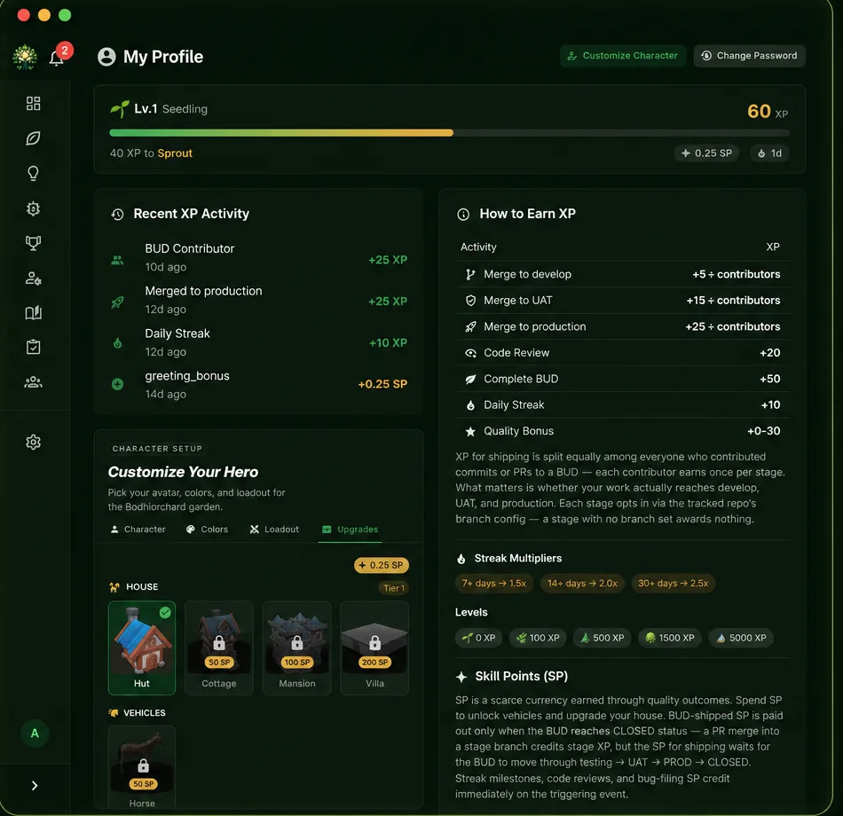 | 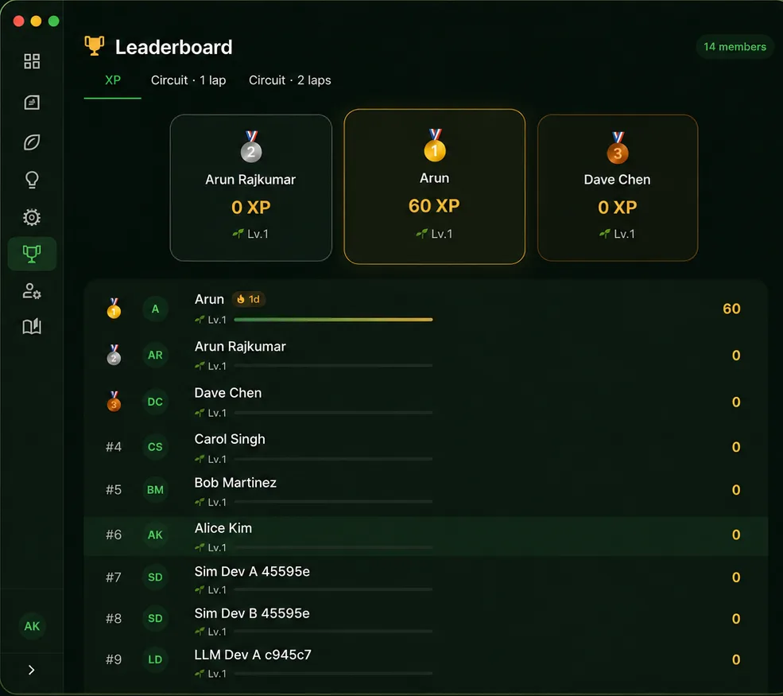 | 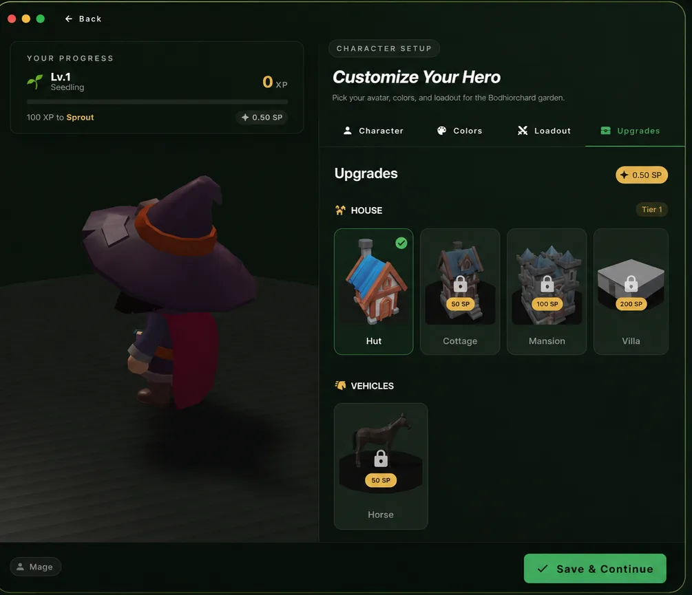 |

And yes — your codebase is a living orchard. Repos as trees, features as fruit, your team walking the garden:

<div align="center">

<a href="https://youtu.be/OxoqBI7BNxU">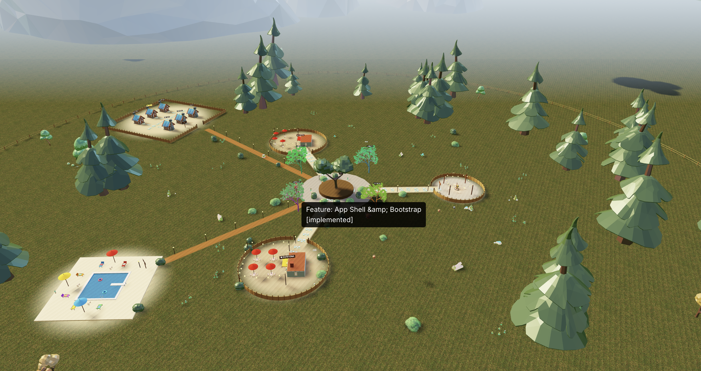</a>

</div>

**More walkthroughs:** [Setup](https://youtu.be/ot-BmKxRgRA) · [Slack triage & MCP tools](https://youtu.be/i8kZdcL1bME) · [Requirements & estimation](https://youtu.be/YBwdTes0Fno) · [Design phase](https://youtu.be/lV71qhmfzzw) · [Development & retrospective](https://youtu.be/YjRihN_SKaw)

## How it works

<div align="center">

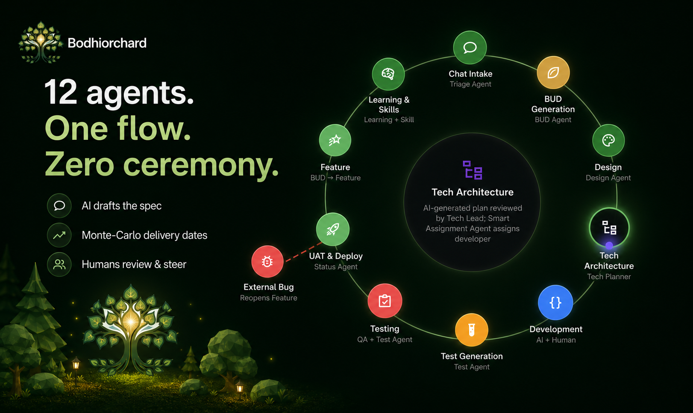

</div>

Every feature lives in one **BUD** (Business Understanding Document) that moves through the lifecycle, with an agent driving each phase and a human gate between phases:

```
bud → design → tech_arch → development → testing → uat → prod → closed
                                                              ↳ discarded (any time)
```

- **Slack-native intake** — post in `#feature-requests`, the Triage Agent interviews you in-thread, checks duplicates via vector search, and queues for PM approval.
- **Multi-repo code intelligence** — a tree-sitter code-graph indexer scans your repos, detects feature clusters across them, and answers blast-radius queries ("what breaks if I change this?").
- **Smart quality loops** — production bugs auto-link to the originating BUD; threshold breaches trigger reassignment; every fix feeds the knowledge base.
- **Developer skill profiling** — per-module expertise scores rebuilt nightly from git history, with bus-factor alerts and best-fit assignment.
- **Living knowledge** — git repos, agent skills, the central DB, and vector search stay auto-synced and feed every agent prompt.
- **Enterprise-grade security** — multi-tenant isolation, RBAC with 9 roles, AES encryption at rest, JWT auth, full audit trail.

## The Twelve Agents

| Agent | What it does |
|---|---|
| **Triage** | Interviews requesters in Slack, checks capacity, finds duplicates, estimates complexity |
| **BUD** | Drafts the full spec with codebase context, enterprise rules, and prior art |
| **Design** | Scopes UI/UX requirements, generates component breakdowns and interaction specs |
| **Tech Plan** | Creates file-level implementation TODOs with architecture and dependency analysis |
| **Smart Assignment** | Suggests the best-fit developer from skill profiles and real-time capacity |
| **Status** | Detects PR merges via GitHub webhooks, advances BUD status, notifies stakeholders |
| **Standup** | Aggregates git/PR/bug/chat activity into daily summaries with risk flags |
| **Test Plan** | Auto-generates e2e, unit/integration, manual UAT, and security test cases |
| **Bug Linker** | Links incoming bugs to BUDs via vector search, monitors quality thresholds |
| **Reassignment** | Rotates developers to bug review when thresholds are exceeded |
| **Learning** | Analyses cycle time vs estimates and writes the retrospective on every deploy |
| **Skill** | Rebuilds developer skill profiles nightly from git, BUD, and bug history |

Every agent action is audited and reviewable in the UI. Triggers, hand-offs, and capabilities: **[AGENTS.md](AGENTS.md)**.

## The Manifesto

Eight principles, deliberately echoing the Agile Manifesto's "X over Y" structure:

| We value… | …over |
|---|---|
| **AI-generated first drafts** | blank-page paralysis |
| **Cycle time predictions** | story points & planning poker |
| **Continuous learning** | post-mortems after the damage |
| **Human decisions** | human busywork |
| **Living knowledge** | stale wiki pages |
| **BUD as single source of truth** | scattered tickets & docs |
| **Skills that grow with the team** | static role assignments |
| **Auto-healing quality loops** | manual bug triage |

## Architecture

**Stack:** FastAPI + SQLAlchemy 2.0 (async) on Python 3.12 · Vue 3 + Vuetify + PlayCanvas (3D) · Colyseus multiplayer · PostgreSQL 16 + pgvector · Redis · local ONNX embeddings (fastembed).

```
backend/     FastAPI — REST API, 12 agents, MCP server, code-graph indexer
frontend/    Vue 3 SPA — BUD board, Living Tree 3D dashboard, settings
multiplayer/ Colyseus server — shared 3D world state
shared/      World layout consumed by frontend + multiplayer
examples/    TaskFlow demo repos (cross-repo feature detection)
```

The agent layer is engine-independent: a per-org provider selector runs the codebase-aware agents through **Claude Code, GitHub Copilot, or OpenAI Codex** — each org picks one in setup, and all three reach the same tools via one STDIO MCP bridge — with Ollama next. Adding an engine is a thin adapter, not a rewrite. Bodhiorchard also runs its own **MCP server** so any of those CLIs (or any MCP client) can drive the BUD lifecycle, query the code graph, and read team context.

## Documentation

| Doc | What's inside |
|---|---|
| [Deployment Guide](docs/deployment.md) | npx installer, Full Docker vs Hybrid setup, system diagram, TaskFlow demo dataset |
| [AI Engines & MCP Server](docs/ai-engines.md) | Engine roadmap, auth modes, full MCP tool reference, client registration |
| [API Reference](docs/api.md) | REST endpoints, WebSocket jobs, environment variables |
| [AGENTS.md](AGENTS.md) | Per-agent capabilities and triggers |
| [BODHIORCHARD-ARCHITECTURE.md](BODHIORCHARD-ARCHITECTURE.md) | The full architecture spec |
| [MCP-REMOTE.md](MCP-REMOTE.md) | Bring-your-own-AI via the remote MCP endpoint |

## FAQ

### What is Agent-Driven Development?

A methodology where specialised AI agents — not humans running status meetings — drive every phase of the software lifecycle, while humans review, decide, and steer. It sits in the slot Agile occupied in 2001: a reorganisation of work around new capabilities. The methodology is free to adopt with or without Bodhiorchard — see [bodhiorchard.ai](https://bodhiorchard.ai/).

### Is Bodhiorchard a self-hosted Jira alternative?

Yes — for the full workflow layer (intake through retrospective). It's especially relevant for teams affected by Atlassian sunsetting self-hosted Jira licences (new licences end March 2026, full shutdown 2029).

### Does my code leave my machine?

The data plane — Postgres, embeddings, BUDs, scanned repos, audit log — is always local. Only LLM prompts leave, and only when you choose cloud inference. Fully air-gapped operation arrives with the Ollama preset.

### Do I need a Claude subscription?

No — and you're not tied to Claude at all. Pick your agent CLI per organization in setup: **Claude Code**, **GitHub Copilot**, or **OpenAI Codex**. For each you can either paste an API key / token (pay-per-token) or, in Hybrid mode, inherit the host's existing login (`claude login`, `gh`/Copilot login, or `codex login`) so the agents run on your flat-rate subscription.

### How is this different from Cursor, Tabby, or Continue?

Those are IDE-side coding assistants for an individual developer. Bodhiorchard is the orchestration and project-management layer above them — intake, specs, estimation, assignment, test plans, bug linking, retrospectives. Pair them freely.

### How does it compare to GitHub Copilot Workspace?

Copilot Workspace is cloud-only and GitHub-bound. Bodhiorchard is self-hosted, repo-agnostic (GitHub, GitLab, self-hosted Git), and AI-engine-agnostic.

### What does "BUD" mean?

**Business Understanding Document** — one markdown document per feature holding spec, tech spec, test plan, acceptance criteria, and full history.

### Can I use it commercially?

Yes — **Apache 2.0**, including embedding in proprietary products. Contributions require DCO sign-off (`git commit -s`). Commercial licences with support are available separately from the maintainer.

### Does it run on Windows?

Yes, via WSL2 in either deployment mode.

## Roadmap

- **Shipped** — core platform (auth, multi-tenant, RBAC), BUD lifecycle, feature registry with vector search, repo scanning + code intelligence, skill profiling, 3D Living Tree, Slack-native triage **and real-time Slack bot conversations**, **GitHub webhook pipeline** (PR-merge → BUD status + repo re-scan), **automated test-plan generation from BUDs** (unit / integration / e2e / security / UAT), **CI/CD integration** (QA-automation repo wired via MCP; test commits flow back to the BUD), MCP server, 12 agent definitions, `npx bodhiorchard` installer
- **Next** — autonomous agent execution engine: small, low-risk BUDs run tech spec → code → review → test end to end, with a human approval gate before release (deliberately not lights-out)
- **Future** — multi-org marketplace, custom agent builder, analytics dashboards, mobile companion, plugin ecosystem

## Contributing

Contributions welcome — fork, branch, lint (`ruff` / `vue-tsc`), and open a PR. All commits need DCO sign-off (`git commit -s`); see [CONTRIBUTING.md](CONTRIBUTING.md).

## Why "Bodhiorchard"?

**Bodhi** (Sanskrit: "awakening") is what the Buddha attained under the Bodhi tree. An **orchard** is a grove tended with intention so it can bear fruit. The software industry builds tools to make life better, yet the process of building them consumes our lives — ceremonies, status updates, and busywork that were meant to help but became the work itself.

Bodhiorchard exists because **AI should give humans their time back**. The agents are the orchardists: they water, prune, and tend the soil so the trees can grow and the humans who planted them can step back and enjoy the harvest.

*Build well. Then go outside.*

## License

Apache License 2.0 — see [LICENSE](LICENSE) and [NOTICE](NOTICE).

---

<div align="center">

**Built by [Arun Rajkumar](https://github.com/mickyarun)**

If Bodhiorchard helps your team, give it a ⭐ and spread the word.

<sub>&copy; 2025-2026 Arun Rajkumar. Bodhiorchard&trade; is a trademark of Arun Rajkumar.<br>Independent open-source project — not affiliated with any employer or client.</sub>

</div>
